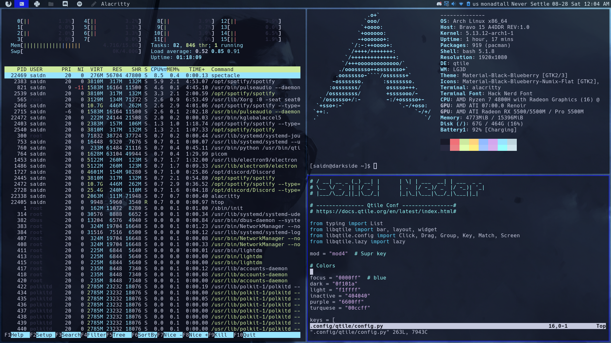

# The dotfiles of my window managers!

## Qtile:

Based totally on utility and minimalism, not that much on the aesthetic,
being at the same time lighting fast and easily configurable thanks to the
power of python!

## The Software that I use

|  Name   | Description|
|---------|------------|
|Alacritty| Lighting fast terminal emulator|
|Thunar| File explorer|
|Pulseaudio| Audio for the system|
| Xorg| Dsplay server|
|Nvim| Best vim editor out there|
|Atom| GUI text editor|
|VLC| Multimedia
|Pavucontrol| Mixer for audio
|Volumeicon| Self-explanatory
|Cbatticon| Battery Icon
|Feh| For wallpapers
|Redshift| take care of your eyes

I promise am going to upgrade this readme and the file structure, soon I will post my DWM config!  
