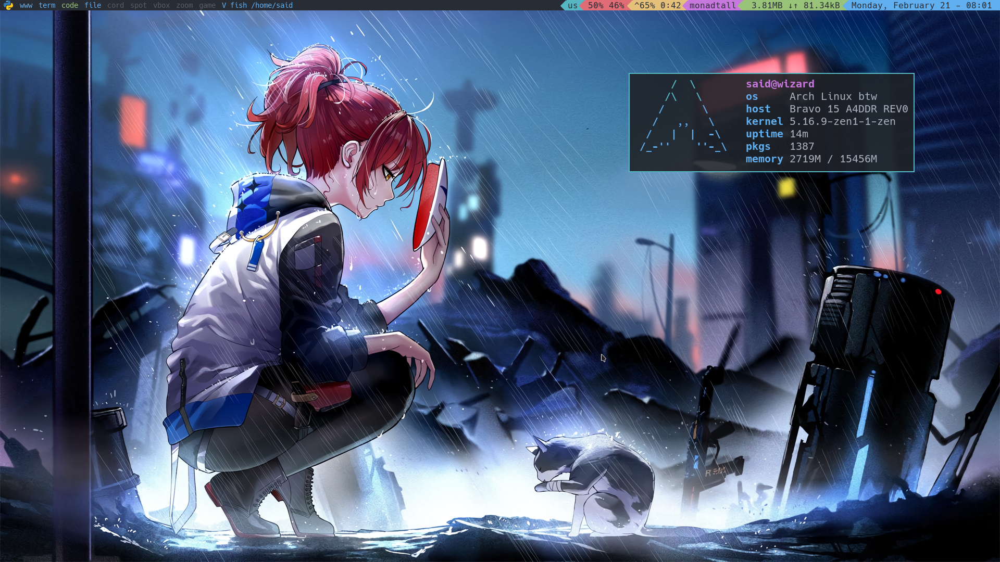
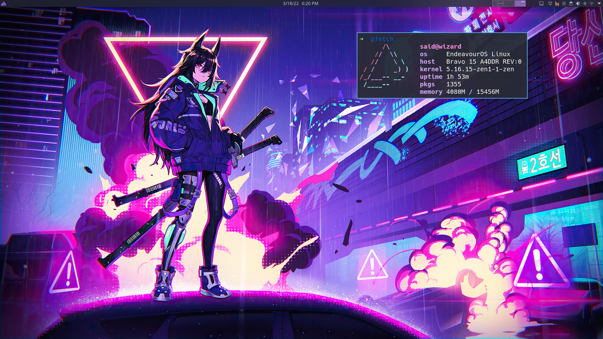

# My dotfiles

Welcome to my dotfiles, these are my config files for my window managers and other related programs!

## My Qtile setup

## My KDE desktop

## The Software that I use

| Name      | Description                     |
|-----------|---------------------------------|
| Alacritty | Lighting fast terminal emulator |
| Thunar    | File explorer                   |
| Pipewire  | Audio for the system            |
| Xorg      | Display server                  |
| Nvim      | Best editor out there       |
| Atom      | GUI text editor                 |
| mpv       | Multimedia                      |
|Pavucontrol| Mixer for audio
| Nitrogen | For wallpapers |
| Redshift  | Take care of your eyes

