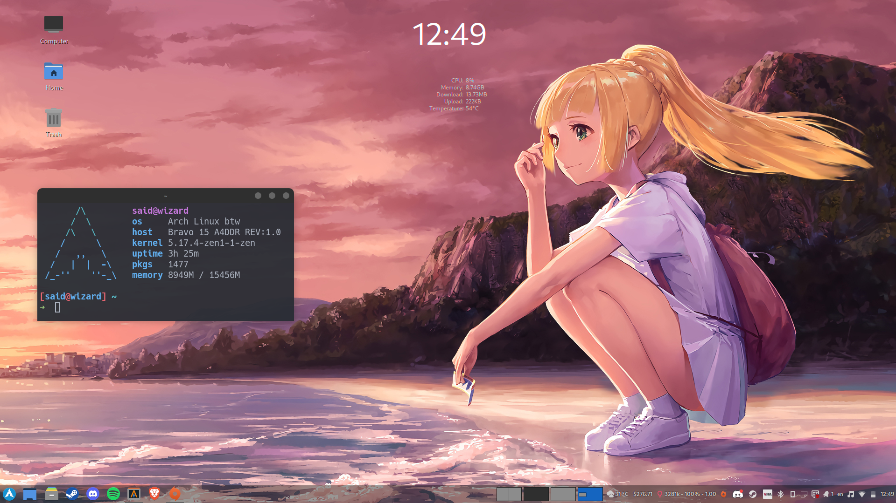
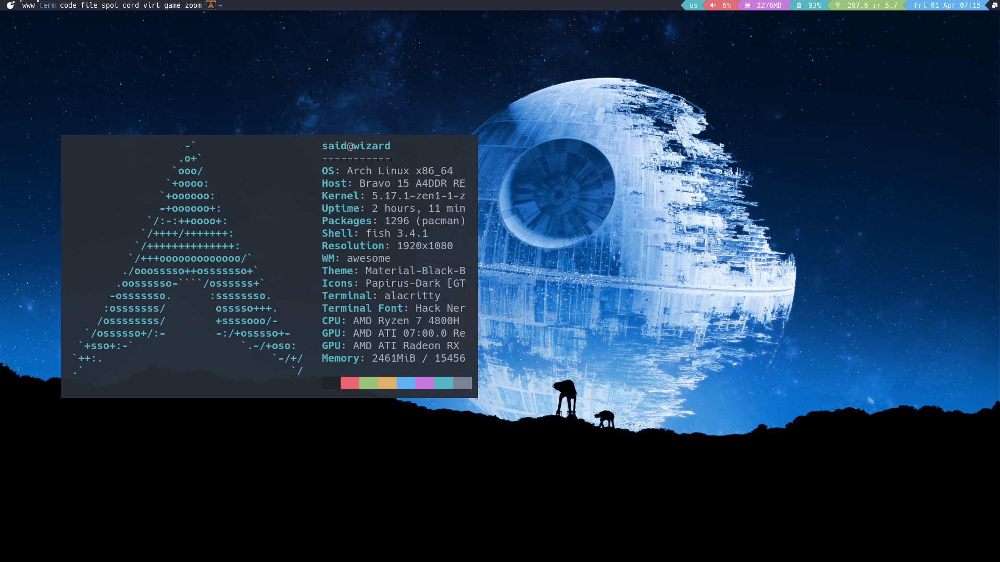
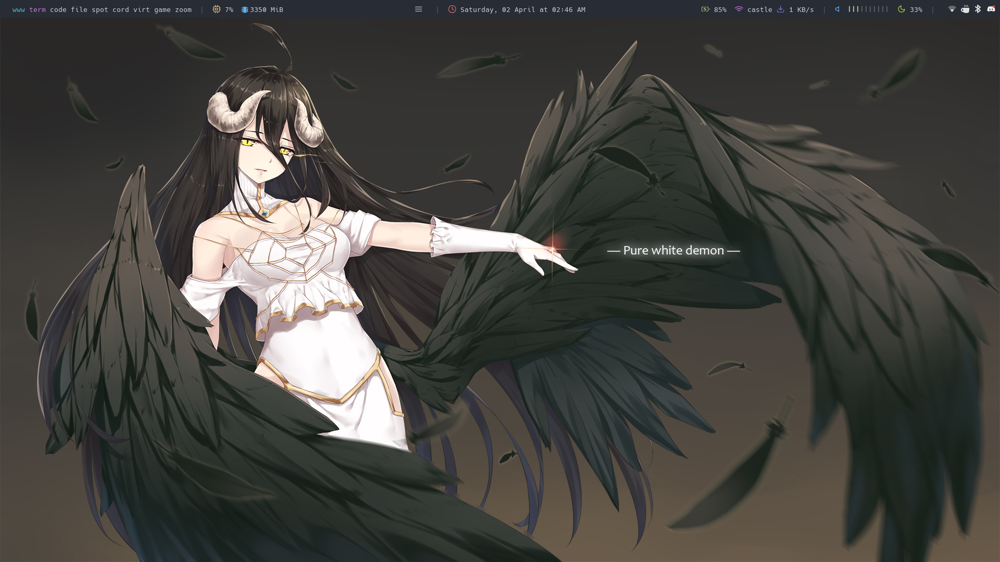
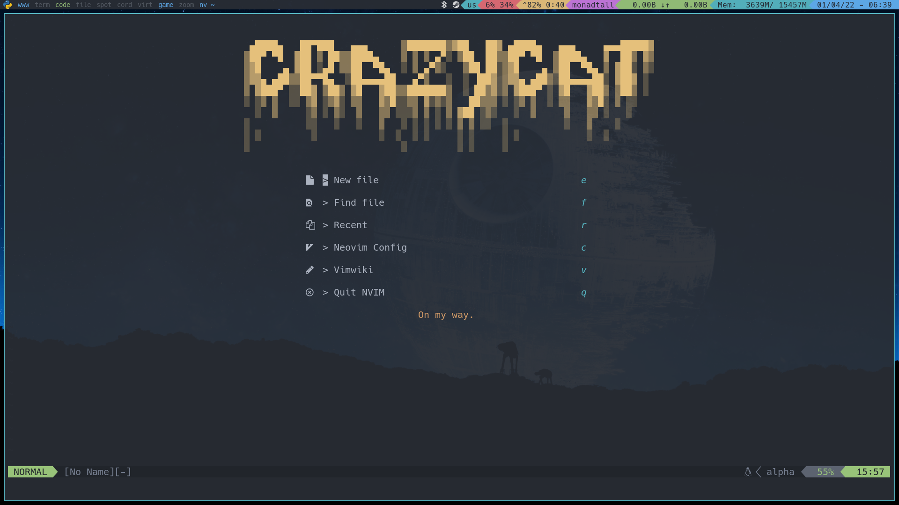

# Dotfiles


# Contents
- **Desktop Enviroment**
  - [Cinnamon](https://github.com/crazyc4t/dotfiles/blob/main/cinnamon.png)
- **Window Managers**
  - [Qtile](https://github.com/crazyc4t/dotfiles/tree/main/qtile)
  - [Awesome](https://github.com/crazyc4t/dotfiles/tree/main/awesome)
  - [Herbstluftwm](https://github.com/crazyc4t/dotfiles/tree/main/herbstluftwm)
  - [Leftwm](https://github.com/crazyc4t/dotfiles/tree/main/leftwm)
- **Terminal Related**
  - [Alacritty](https://github.com/crazyc4t/dotfiles/blob/main/alacritty)
  - [Bat](https://github.com/crazyc4t/dotfiles/tree/main/bat)
  - [Dunst](https://github.com/crazyc4t/dotfiles/tree/main/dunst)
  - [Picom](https://github.com/crazyc4t/dotfiles/tree/main/picom)
  - [Rofi](https://github.com/crazyc4t/dotfiles/tree/main/rofi)
  - [Zathura](https://github.com/crazyc4t/dotfiles/tree/main/zathura)
  - [Fish shell](https://github.com/crazyc4t/dotfiles/tree/main/fish)
- [Neovim 100% written in lua](https://github.com/crazyc4t/dotfiles/tree/main/nvim)

# Intro
This documentation is about my laptop configuration that I use day to day to code, write LaTeX documents and game with lutris and steam and how to set it up.

Am using [Arch Linux](https://archlinux.org/) btw, and my configurations are based on command line interfaces and window managers, you are free to fork, copy or use the code as however you want!

# My desktop enviroment
I have now changed my workflow, and I have added a desktop enviroment to my setup, being [cinnamon](https://wiki.archlinux.org/title/Cinnamon) that is a DE based on Gnome 2.0, and is really beautiful, friendly to use, low on resources, and not bloated at all!



# My window managers
Here is some screenshots of my available window managers, yet there's some more to configure
- [x] [Qtile](http://www.qtile.org/)
- [x] [Awesome](https://awesomewm.org/)
- [x] [Herbstluftwm](https://herbstluftwm.org/)
- [x] [LeftWM](http://leftwm.org/)
- [ ] [Xmonad](https://xmonad.org/)
- [ ] [Dwm](https://dwm.suckless.org/)

## Qtile


## Awesome


## Herbsluftwm


## LeftWM


## How to install Arch Linux

The best resources out there are:
- [Arch Wiki](https://wiki.archlinux.org/title/Installation_guide)
- [The complete guide on how to install Arch by LearnLinuxTV](https://youtu.be/DPLnBPM4DhI)
## AUR helper of choice
Right now am using [`yay`](https://github.com/Jguer/yay) as an AUR helper, here's how to install it:
```
pacman -S --needed git base-devel && git clone https://aur.archlinux.org/yay.git && cd yay && makepkg -si
```

## Using doas instead of sudo
Am using [doas](https://wiki.archlinux.org/title/Doas) on my system because sudo is an overkill for my requirements, install doas by:

`sudo pacman -S opendoas`

Then create a `doas.conf` on the `etc` folder and permit your username for privilege escalation and persistence:

`permit persist said as root`

Then transition to it by adding an alias to your shell:

`alias sudo='doas'`

And finally remove sudo and replace it with doas:

`doas pacman -R sudo`

Then as root (you can do so by doing `doas -s`):

`ln -s $(which doas) /usr/bin/sudo`

## Installing Xorg
Installing xorg is really simple, just do:

`doas pacman -S xorg`

And you are ready!

## Install some basic utilities
This can change depending of your preferences, but a browser, a code editor, git and a terminal are required

`yay -S brave alacritty neovim git`

## Using a Display manager 
If you followed the Arch Linux installation guide made by LearnLinuxTV, you should be on a tty, with xorg installed, but no desktop enviroment, so before installing any type of window manager, we should install first the display manager so we can log into different window managers.

We are going to use the [Aether](https://github.com/NoiSek/Aether) theme made by NoiSek (great theme thanks!) and is as easy by doing:

`yay -S lightdm-webkit-theme-aether`

And then enable the display manager:

`sudo systemctl enable lightdm.service`

Note: I no longer use the Aether theme, am using the [Osmos](https://github.com/Warinyourself/lightdm-webkit-theme-osmos) theme that supports tons of window managers, you can install it by doing:

`yay -S lightdm-webkit-theme-osmos`

## Installing your desktop!
My desktop setup is made by cinnamon and qtile, let's install cinnamon first:
`yay -S xed pix xreader metacity gnome-shell cinnamon papirus-icon-theme phinger-cursors blueberry`

For customizing the desktop you can follow this [guide](https://odysee.com/@EF-TechMadeSimple:3/5-cinnamon-customization:e)
### Window managers
You can install any type of window manager, but for me is essential to have qtile, so that is what am going to do:

`doas pacman -S qtile python-pip`

After that install some dependencies with pip:

`pip install psutil`

And now clone this repo by doing so:

`git clone https://github.com/crazyc4t/dotfiles.git`

Then, move the qtile folder to your ~/.config/ folder:

`cd dotfiles && mv qtile/ ~/.config/`

Then finally reboot and enjoy Qtile!

## Multimedia

### Audio
Am using [Pipewire](https://wiki.archlinux.org/title/PipeWire) for my audio, install it by doing:

```
doas pacman -S pipewire wireplumber pipewire-pulse pipewire-jack pipewire-alsa xdg-desktop-portal 
```

### Bluetooth
Install bluetooth by doing
```
doas pacman -S bluez bluez-utils blueman
```

And finally enable the bluetooth service:
`doas systemctl enable --now bluetooth`

### Video & music
Here we will be installing spotify for music and vlc, alongside the vlc-bittorrent extension for streaming torrents hehe:
`yay -S spotify vlc vlc-bittorrent`

## Neovim 
If you use Neovim, this is your section, my neovim config is written 100% in lua, with linting, diagnostic and formatting support for:
- Python 
- Javascript
- Lua 
- Arduino
- Go 
- LaTeX
- Bash
- Markdown (With vimwiki)

So install neovim and healthy dependencies:
`doas pacman -S neovim python-pip nodejs npm xclip`

And then get healthy:
`pip install nvim`
`npm i -g nvim`

Finally install packer for installing plugins:
`yay -S nvim-packer-git`

Clone my dotfiles and move them to your ~/.config/:
`git clone git@github.com:crazyc4t/dotfiles.git`
`cd dotfiles/nvim && rm -rf plugin/ && cd .. && mv nvim ~/.config/`

And then sync it all and enjoy!
<Shift + p> or = `:PackerSync`



## Fonts
Install these fonts for compatibility:
`yay -S gnu-free-fonts noto-fonts ttf-ms-win10-auto noto-fonts-emoji`

### Nerd fonts 
Am going to install all nerd fonts for preference, since I like having all of them at my disposal, to install it we need to follow certain steps made by the AUR [maintainer](https://aur.archlinux.org/packages/nerd-fonts-complete):

```
yay --getpkgbuild nerd-fonts-complete (or git clone https://aur.archlinux.org/nerd-fonts-complete.git)
cd nerd-fonts-complete
wget -O nerd-fonts-2.1.0.tar.gz https://github.com/ryanoasis/nerd-fonts/archive/v2.1.0.tar.gz
makepkg -sci BUILDDIR=.
```

## Gaming
With the proton project developed by valve, playing on Linux is easier as ever! Prepare yourself to install a ton of packages...

### Multilib
You need to edit the `pacman.conf` located in `/etc/pacman.conf` and uncomment the `multilib` repository at the final part of the file.
```
/etc/pacman.conf
--------------------------------------------------------------------------------------
[multilib]
Include = /etc/pacman.d/mirrorlist
```
Then upgrade the system: `doas pacman -Syu`

### Installing drivers
First let's install the drivers required for running games:
- AMD
  - `sudo pacman -S --needed lib32-mesa vulkan-radeon lib32-vulkan-radeon vulkan-icd-loader lib32-vulkan-icd-loader`
- Nvidia
  - `sudo pacman -S --needed nvidia-dkms nvidia-utils lib32-nvidia-utils nvidia-settings vulkan-icd-loader lib32-vulkan-icd-loader`
- Intel
  - `sudo pacman -S --needed lib32-mesa vulkan-intel lib32-vulkan-intel vulkan-icd-loader lib32-vulkan-icd-loader`

### Installing wine
This is a big list of packages but you will need them to make the games work properly.

```
sudo pacman -S --needed wine-staging giflib lib32-giflib libpng lib32-libpng libldap lib32-libldap gnutls lib32-gnutls \
mpg123 lib32-mpg123 openal lib32-openal v4l-utils lib32-v4l-utils libpulse lib32-libpulse libgpg-error \
lib32-libgpg-error alsa-plugins lib32-alsa-plugins alsa-lib lib32-alsa-lib libjpeg-turbo lib32-libjpeg-turbo \
sqlite lib32-sqlite libxcomposite lib32-libxcomposite libxinerama lib32-libgcrypt libgcrypt lib32-libxinerama \
ncurses lib32-ncurses opencl-icd-loader lib32-opencl-icd-loader libxslt lib32-libxslt libva lib32-libva gtk3 \
lib32-gtk3 gst-plugins-base-libs lib32-gst-plugins-base-libs vulkan-icd-loader lib32-vulkan-icd-loader
```

### Installing utilities
Let's install the fun part!

`yay -S lutris steam winetricks protontricks mangohud gamemode`

## Outro
So this is the way I work with my setup! hope you like it and it was useful!

# The Software that I use

| Name      | Description                     |
|-----------|---------------------------------|
| Alacritty | Lighting fast terminal emulator |
| Thunar    | File explorer                   |
| Pipewire  | Audio for the system            |
| Xorg      | Display server                  |
| Nvim      | Best editor out there           |
| Vlc       | Multimedia                      |
|Pavucontrol| Mixer for audio
| Nitrogen        | For wallpapers                                 |
| Redshift        | Nightlight                                     |
| Rofi            | Launch Menu                                    |
| Brave           | Web Browser                                    |
| Lxsession-gtk   | Authorization Agent                            |
| Lxappereance    | GUI for theming                                |
| Hack Nerd Font  | Font used for coding                           |
| Gscreenshot     | Screenshot tool with copy to clipboard support |
| Dunst           | Notifications                                  |
| Arandr          | Manages your screens                           |
| Lutris          | Manages wine games                             |
| Material Black  | GTK theme                                      |
| Phinger Cursors | Cursor theme                                   |
| Qt5ct           | QT theme manager                               |
| Kvantum         | QT theme installer                             |
| Kdenlive        | Video editor                                   |
| Gimp            | Image manipulator                              |
| Doas            | Privilege escalation done right                |
| OBS             | Screen recording                               |
| texlive-most    | LaTeX software                                 |
| Qbittorrent     | For downloading torrents                       |
| Lightdm         | Display Manager with the aether theme          |
| Git             | Version control                                |
| Starship        | Prompt for my shell                            |
| Papirus         | Icons                                          |
